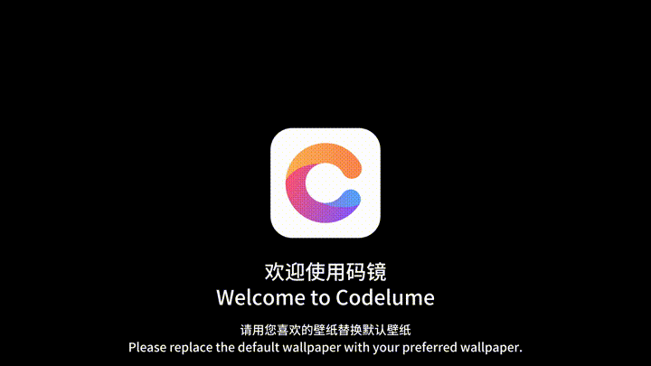
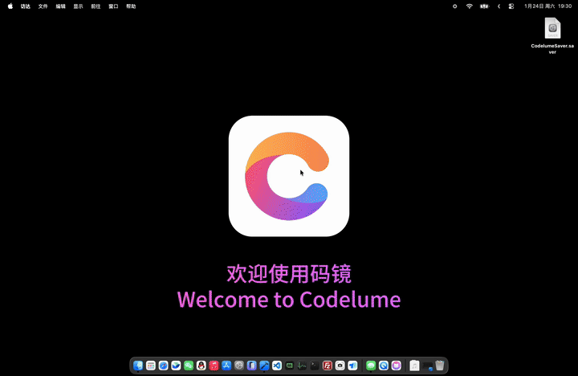

# CodelumeSaver

A macOS utility to set videos or Codelume bundles as screen savers.

# Preview

This is the default screensaver video. After installation, you can replace it with your own video.

# Download

## Open Source Version

Completely free. Clone, build, and customize from GitHub.

## App Store Version

Paid download to support Apple Developer Program costs. Auto-updated.

[Download on App Store](https://apps.apple.com/us/app/%E7%A0%81%E9%95%9C/id6751061329?mt=12)

# Installation

# Plan

 - Support playing CodeLume bundles based on the SpriteKit framework.
 - Support playing CodeLume bundles based on the SceneKit framework (SceneKit has been deprecated and may be replaced by Realkit).

# Donate

CodelumeSaver is an open-source project developed in my spare time. Your support is the greatest motivation for me to continue maintaining and updating this project.

There are several ways you can support its development:

1. Purchase the App Store Version (Recommended)

    The simplest and most direct way to support is to download the paid version from the App Store.

    - This helps cover the annual costs of the Apple Developer Program.
    - You'll get the convenience of automatic updates.

2. Star and Share on GitHub

    - Star the repository on GitHub to increase its visibility.
    - Share it with your friends, colleagues, or on social media. Word-of-mouth support is incredibly valuable!

3. Contribute to the Project

    The project is open source under the Apache v2.0 License. You are welcome to:

    - Submit Pull Requests to fix bugs or add new features.
    - Report issues or suggest improvements in the Issues section.

# License
Apache v2.0 License.